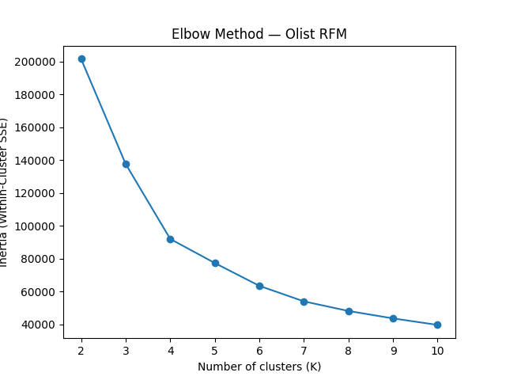
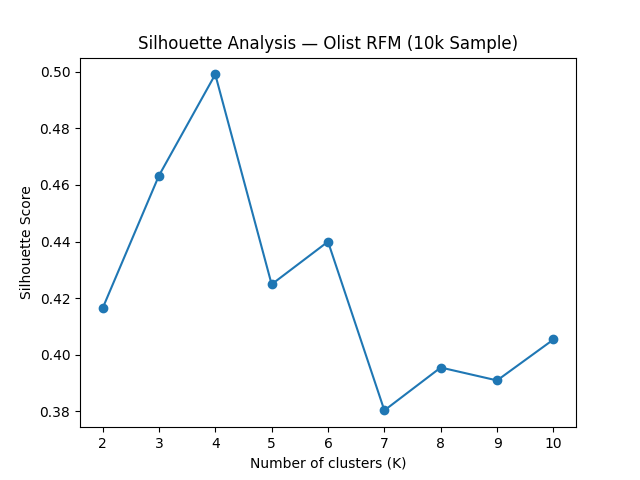
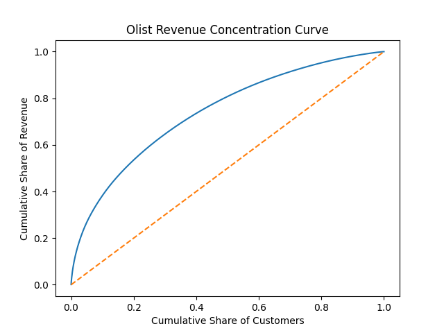
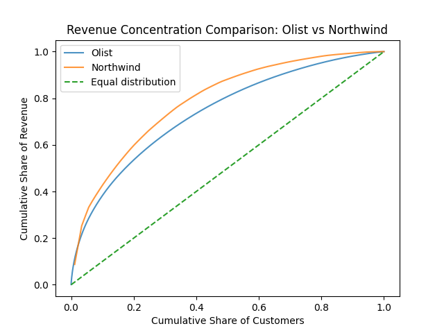

# Customer Segmentation with Real-World E-Commerce Data

**Olist + Northwind | Consultant-Grade Portfolio Project**

---

[](https://www.python.org/)
[](https://pandas.pydata.org/)
[](https://numpy.org/)
[](https://scikit-learn.org/)
[](https://matplotlib.org/)
[](LICENSE)

---

## 1. Project Overview

Most e-commerce businesses face the same reality: **not all customers contribute equally to revenue**. Marketing budgets are limited, retention efforts are costly, and without clear segmentation, resources are often misallocated.

This project demonstrates a **realistic, consultant-grade customer segmentation workflow** using transactional data only — mirroring real-world constraints faced by analysts, freelancers, and consultants.

The goal is not to build the most complex model, but to deliver **actionable customer insights that decision-makers can trust**.

---

## Key Findings

**Segmentation Result**  
K-Means clustering with **K = 4** identifies four distinct customer segments, validated using elbow analysis, silhouette scores, and cross-dataset comparison with Northwind.

**Revenue Concentration**  
A minority of customers contributes a majority of total revenue (Pareto-like pattern), confirming that differentiated customer treatment is economically justified.

**Primary Segments Identified**:
- **High-Value Loyalists**: Small customer share, disproportionately high revenue contribution — primary retention focus
- **At-Risk High Spenders**: Meaningful revenue contributors with elevated churn risk — reactivation opportunity
- **Frequent Low-Value Buyers**: High engagement but limited per-customer value — controlled upsell candidates
- **One-Time Buyers**: Large customer share with minimal revenue impact — cost-control segment

**Business Impact**  
Segment-specific strategies enable efficient allocation of marketing and retention resources, prioritizing high-value customers while applying cost-controlled approaches to low-impact segments.

---

## 2. Business Problem

> "We have many customers, but not all customers contribute equally to revenue. We need to understand which customer segments matter, how they behave differently, and where to focus retention and marketing efforts."

This problem is common across:

* E-commerce platforms
* Retail businesses
* Marketplaces
* Subscription-adjacent products

---

## 3. Business Objectives

The project aims to:

1. Identify distinct customer segments based on **observed purchasing behavior**
2. Quantify **value differences** between segments
3. Translate segments into **clear business actions**, such as:

   * Retain
   * Reactivate
   * Upsell
   * De-prioritize

---

## 4. Analytical Constraints (Explicit)

To reflect real client conditions, the analysis operates under the following constraints:

* No controlled experiments
* No demographic enrichment
* No customer lifetime labels
* Historical behavior only (no future leakage)

These constraints are **intentional** and improve the credibility of the results.

---

## 5. Datasets Used

### 5.1 Olist Brazilian E-Commerce Dataset (Primary)

Used for **segmentation modeling**.

Provides:

* Transaction history
* Customer identifiers
* Order timestamps
* Payment values
* Reviews and delivery outcomes

Key limitation:

* No demographic variables (age, income, location granularity)

This makes Olist suitable for **behavior-based segmentation**.

---

### 5.2 Northwind Traders Dataset (Secondary)

Used for **validation and benchmarking only**.

Purpose:

* Acts as an independent retail reference
* Helps verify whether observed patterns are typical of retail businesses

Important rule:

* **No row-level integration** with Olist
* Used analytically, not structurally

This distinction is explicitly stated to avoid methodological misuse.

---

## 6. Methodology Overview

### 6.1 Feature Engineering — RFM Framework

For both datasets (independently), classic **RFM metrics** were computed:

| Metric    | Definition               | Business Meaning |
| --------- | ------------------------ | ---------------- |
| Recency   | Days since last purchase | Churn risk       |
| Frequency | Number of orders         | Engagement       |
| Monetary  | Total spend              | Customer value   |

The same formulas and logic were applied to both datasets to ensure comparability.

---

### 6.2 Exploratory Analysis

Before clustering, exploratory analysis was conducted to answer key questions:

* Is revenue concentrated among a small share of customers?
* Are frequent buyers always high-value?
* How skewed is customer behavior?

This step is critical for **client trust** — clusters are not presented without showing raw data patterns.

---

### 6.2.1 Customer Value Distribution (Pre-Segmentation)

Exploratory analysis of customer spending patterns reveals a highly skewed distribution of customer value, where a small proportion of customers accounts for a disproportionately large share of total revenue.

This observed skewness provides the empirical justification for applying customer segmentation rather than relying on average-based customer treatment.

---

### 6.3 Segmentation Modeling

* Algorithm: **K-Means clustering**
* Features: Scaled RFM variables
* Cluster count selection based on:

  * Elbow method
  * Silhouette analysis (sampled for scalability)
  * Business interpretability

The final number of clusters prioritizes **actionability over mathematical perfection**.

---

### 6.4 Segment Labeling

Clusters are translated into **business-first segment labels**, such as:

* High-Value Loyalists
* Frequent Low-Value Buyers
* At-Risk High Spenders
* One-Time Buyers

Labels are designed to be:

* Interpretable
* Executive-friendly
* Directly actionable

---

### 6.5 Visual Evidence & Key Insights (Client-Facing)

This project emphasizes visual validation to ensure segmentation decisions are grounded in observable business patterns rather than algorithmic abstraction.  

All visuals are stored in the /visuals directory and referenced explicitly below.  

---

## Key Visualizations

The following visual artifacts support both **model validation** and **business interpretation** of customer segments.  
All figures are stored in the `/visuals` directory for auditability and reuse.

---

### Elbow Method — Optimal K Selection


Shows diminishing returns beyond **K = 4**, indicating that additional clusters increase complexity without proportional explanatory value.

---

### Silhouette Analysis — Cluster Separation


Confirms **K = 4** as the optimal balance between cohesion and separation using geometric validation.

---

### Revenue Concentration (Pareto Validation)


Demonstrates that a minority of customers contributes a majority of revenue, reinforcing the strategic importance of differentiated customer treatment.

---

### Cross-Dataset Validation (Olist vs Northwind)


Validates that observed customer value concentration patterns are **structural**, not dataset-specific.

---

### 6.6 Final Cluster Selection (Evidence-Driven)

Final choice: **K = 4**

Justification:

- Supported by elbow curve inflection

- Supported by silhouette score peak

- Produces interpretable, action-oriented segments

- Consistent with retail domain expectations

This decision prioritizes business usability over mathematical overfitting.  

---

## 7. Segment Profiling & Value Analysis

Each segment is profiled using:

* Share of customers
* Share of total revenue
* Average order value
* Recency patterns

This directly answers the business question:

> "Where should we spend money, and where should we not?"

---

### 7.1 Business Interpretation & Segment Actionability

From a business perspective, customer segmentation answers one core question:

**Which customers deserve differentiated treatment?**

By jointly analyzing **customer share** and **revenue share**, the segmentation reveals:

- Which customer segments disproportionately drive revenue  
- Which segments require proactive retention and loyalty investment  
- Which segments may warrant cost control rather than aggressive engagement  

This framing ensures the analysis translates directly into **operational decisions**, making the output usable by:

- Marketing teams (targeted campaigns and budget allocation)
- CRM managers (retention and lifecycle strategies)
- Growth strategists (long-term customer value optimization)

---

## 8. Northwind Validation

To avoid dataset-specific conclusions, Olist results are compared with Northwind patterns:

* Revenue concentration curves
* Frequency vs monetary relationships

The comparison demonstrates that observed behaviors follow **typical retail dynamics**, strengthening confidence in the findings.

---

## 9. Business Recommendations

Each segment receives a recommended action:

| Segment                   | Recommended Action                            |
| ------------------------- | --------------------------------------------- |
| High-Value Loyalists      | Retention & loyalty incentives                |
| At-Risk High Spenders     | Reactivation campaigns                        |
| Frequent Low-Value Buyers | Controlled upsell strategies                  |
| One-Time Buyers           | Cost-efficient nurturing or de-prioritization |

Recommendations are framed in **business language**, not technical jargon.

---

## 10. Limitations & Operational Considerations

### Analytical Limitations
- **No causal inference**: Segmentation identifies patterns, not causes
- **No demographic drivers**: Behavior-only clustering (no age, income, location enrichment)
- **No lifetime value prediction**: Descriptive historical value, not projected CLV
- **Snapshot-based**: No temporal evolution modeling (customers may migrate between segments)

### Operational Constraints
- **Cold start problem**: New customers cannot be immediately segmented (requires purchase history)
- **Segment drift**: Customer behavior changes over time; requires periodic re-segmentation
- **Implementation complexity**: CRM integration and campaign automation require technical resources

### Important Clarifications
**What this analysis DOES provide**:  
✅ Evidence-based customer differentiation  
✅ Clear prioritization framework for resource allocation  
✅ Benchmark patterns validated across datasets  

**What this analysis DOES NOT provide**:  
❌ Guaranteed revenue uplift (requires A/B testing)  
❌ Individual customer predictions (segment-level only)  
❌ Causal explanations of purchase drivers  

### Recommended Next Steps for Production Deployment
1. **A/B testing framework**: Test segment-specific treatments vs. control
2. **Predictive scoring**: Build propensity models within each segment
3. **Temporal modeling**: Track segment migration patterns over time
4. **Demographic enrichment**: Append demographic data where available for richer profiling

---

## 11. Repository Structure

```
├── notebooks/
│   ├── 01_data_cleaning.ipynb
│   ├── 02_feature_engineering.ipynb
│   ├── 03_exploratory_analysis.ipynb
│   ├── 04_segmentation_modeling.ipynb
│   └── 05_customer_personas_business_translation.ipynb
├── visuals/
├── data/
├── reports/
├── LICENSE
├── README.md
├── requirements.txt

```

---

## 12. Who This Project Is For

* Freelance data analysts
* Analytics consultants
* Marketing / CRM analysts
* Hiring managers seeking **business-ready portfolios**

This project emphasizes **clarity, realism, and decision impact** over algorithmic complexity.

---

## Reproducibility & Technical Transparency

This project is designed to be **fully reproducible and auditable** using standard data science tooling.

- Python **≥ 3.9**
- All dependencies explicitly listed in `requirements.txt`
- Random seeds fixed where applicable (e.g., KMeans initialization, sampling)
- Deterministic preprocessing and feature scaling steps

---

### How to use

All notebooks are:
- Sequentially organized
- Modular by analytical stage
- Executable end-to-end without manual intervention

No proprietary software, paid services, or private APIs are required.

---

## Disclaimer

This project is intended for **educational, demonstrative, and portfolio purposes only**.

- It does not represent a production-grade customer segmentation system
- Results are **descriptive**, not causal
- No guarantee of revenue uplift or behavioral change is implied
- Business actions described are illustrative examples, not prescriptive recommendations

The objective of this project is to demonstrate **analytical rigor, methodological transparency, and business translation skills** under realistic consulting constraints.


---

## Author

**Medical AI & Healthcare Data Science Consultant**

Physician (MBBS) with a Master’s in Global Communication and professional training in Machine Learning, Deep Learning, NLP, and AI for Medicine. Experienced in building interpretable risk models and decision-support systems for regulated, data-sensitive environments.
